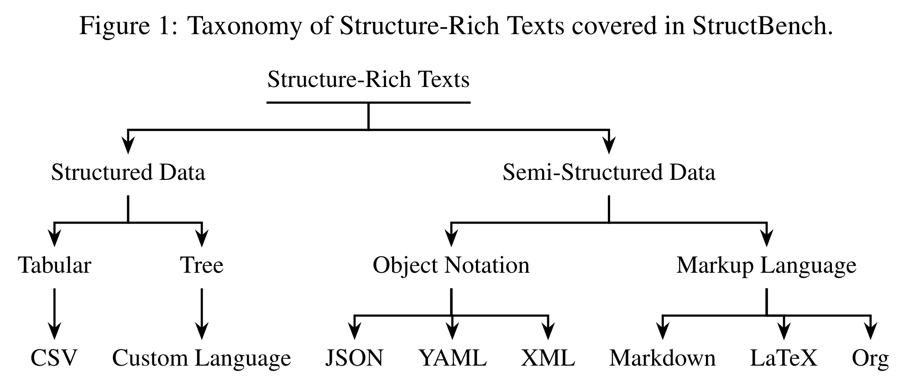
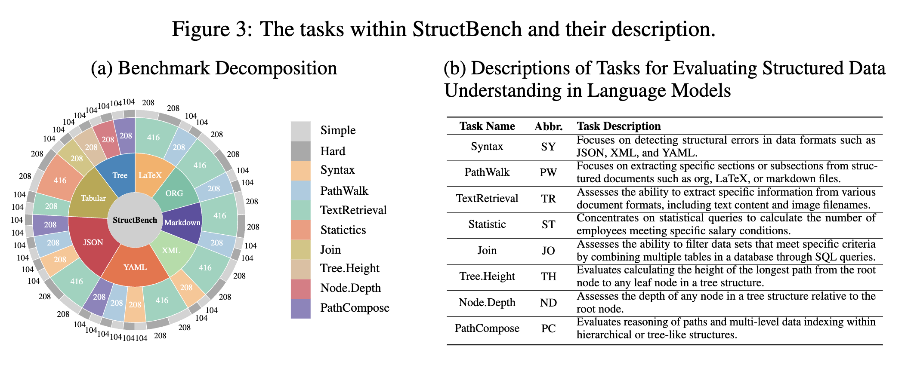

# StructBench: An Autogenerated Benchmark for Evaluating Large Language Model's Ability in Structure-Rich Text Understanding


## 🎉 Overview

Given the substantial volumes of structured data held by many companies, enabling Large Language Models (LLMs) to directly understand structured text in non-structured forms could significantly enhance their capabilities across various business scenarios. To this end, we propose evaluation data generation method for assessing LLM's ability in understanding the structure-rich text, which generates structured data of controllable complexity based on manually crafted question templates and generation rules. Building on this generation method, we introduce StructBench, a benchmark comprising 6,032 questions across 8 different structured languages and 29 specific tasks. Furthermore, considering human proficiency in rule-based tasks, we also present StructBench-Hard, which includes 3,016 questions designed to further examine the gap between LLMs and human performance. Results indicate that the best-performing LLM currently achieve an accuracy of 65.0\% on StructBench-Hard, while human accuracy reaches up to 95.7\%. Moreover, while fine-tuning using StructBench can enhance existing LLMs' understanding of all structured languages, it does not necessarily improve performance across all task types.

The repo mainly consist of:
1. [StructBench](./Dataset) Dataset used in the paper
2. Code used to [generate the dataset](./LLMStructure/datagen.py)

## 🔥 Updates
* 2024/6/29: We released the customization code for customizing your own StructBench.
* 2024/6/19: We released the initial version of the dataset used in the paper.
* 2024/6/15: We released the first version of our [paper](https://arxiv.org/abs/2406.10621).

## 💡 The Introduction to the Existing StructBench

There are eight types of structure-rich languages are covered in StructBench, including seven existing languages and one customized:
<p align="center">
    
</p>

There are eight different tasks in StructBench, and two different level of difficulties are preset.
The statistic information to the existing StructBench and the description of the tasks are listed as follow:
<p align="center">
    
</p>


## ⚙️ Customize Your Own Benchmark for Evaluating LLMs' Structure-Rich Text Understanding Ability

### Dependency Installation
```
conda create -n fcs python=3.10.9
conda activate fcs
pip install fire
```


### Benchmark Generation with Different Setting
Please rewrite the setting in `generate_setting.json`.
The descriptions to all the parameters are directly listed bellow:

```json
{
  "#": 
  {  // Overall Setting
    "output_dir": "",  // where your benchmark files want to be writed down
    "few_shots": []  // how many few_shot do you want to use in your benchmark
  },
  "csv": 
  {
    "nodes": [],  // The depth of your structure-rich data
    "n_ary_ratio": 1,  // The width in each layer
    "para_len_ratio": 6  // useless
  },
  "json": 
  {
    "nodes": [],  // The depth of your structure-rich data
    "n_ary_ratio": 1,  // The width in each layer
    "para_len_ratio": 6  // the max number of char in each item
  },
  "latex": {
    "nodes": [],  // The depth of your structure-rich data
    "n_ary_ratio": 1,  // The width in each layer
    "para_len_ratio": 6  // the max number of char in each item
  },
  "markdown": {
    "nodes": [],  // The depth of your structure-rich data
    "n_ary_ratio": 1,  // The width in each layer
    "para_len_ratio": 6  // the max number of char in each item
  },
  "org": {
    "nodes": [],  // The depth of your structure-rich data
    "n_ary_ratio": 1,  // The width in each layer
    "para_len_ratio": 6  // the max number of char in each item
  },
  "tree": {
    "nodes": [],  // The depth of your structure-rich data
    "n_ary_ratio": 1,  // The width in each layer
    "para_len_ratio": 6  // useless
  },
  "xml": {
    "nodes": [],  // The depth of your structure-rich data
    "n_ary_ratio": 1,  // The width in each layer
    "para_len_ratio": 6 // the max number of char in each item
  },
  "yaml": {
    "nodes": [],  // The depth of your structure-rich data
    "n_ary_ratio": 1,  // The width in each layer
    "para_len_ratio": 6  // the max number of char in each item
  }
}
```
And use the following code to generate the benchmark:
```shell
generate_dataset.sh
```
or
```shell
cd LLMStructure
python datagen.py
```

## 📒 Citation
```
@article{gu2024structbench,
  title={StructBench: An Autogenerated Benchmark for Evaluating Large Language Model's Ability in Structure-Rich Text Understanding},
  author={Gu, Zhouhong and Ye, Haoning and Zhou, Zeyang and Feng, Hongwei and Xiao, Yanghua},
  journal={arXiv preprint arXiv:2406.10621},
  year={2024}
}
```
